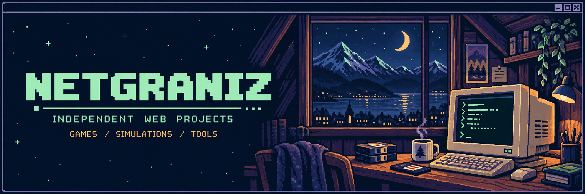

  

<samp>WELCOME TO MY LITTLE CORNER OF THE WEB</samp>

  I'm Artem. I build browser games, simulations and practical little tools. 
  Lightweight projects with a purpose — and room for a little curiosity.

  <a href="https://t.me/NetGraniz"><samp>[ TELEGRAM ]</samp></a>

  

<h2></h2>

<table>
<tr>
<td width="50%" valign="top">
  <h3><samp>01</samp> &nbsp; Gridhaven</h3>
  
A city-builder with economy, utilities, zoning and simulation systems.

  
<samp>SIMULATION / CITY BUILDER</samp>

  
<a href="https://city.nord-fjell.com"><samp>[ START → ]</samp></a>

</td>
<td width="50%" valign="top">
  <h3><samp>02</samp> &nbsp; Quiet Mile</h3>
  
An endless procedural drive through a generated landscape.

  
<samp>3D / PROCEDURAL DRIVE</samp>

  
<a href="https://roads.nord-fjell.com"><samp>[ START → ]</samp></a>

</td>
</tr>
<tr>
<td width="50%" valign="top">
  <h3><samp>03</samp> &nbsp; Barricade</h3>
  
A strategic board game with local play and several AI difficulty levels.

  
<samp>STRATEGY / BOARD GAME</samp>

  
<a href="https://barricade.nord-fjell.com"><samp>[ START → ]</samp></a>

</td>
<td width="50%" valign="top">
  <h3><samp>04</samp> &nbsp; Battleship</h3>
  
Classic sea battle against a computer opponent with adaptive difficulty.

  
<samp>CLASSIC / VS COMPUTER</samp>

  
<a href="https://battleship.nord-fjell.com"><samp>[ START → ]</samp></a>

</td>
</tr>
<tr>
<td width="50%" valign="top">
  <h3><samp>05</samp> &nbsp; Repo Monster Calculator</h3>
  
A compact team-power calculator for selecting available monsters.

  
<samp>GAME UTILITY / CALCULATOR</samp>

  
<a href="https://repo.nord-fjell.com"><samp>[ START → ]</samp></a>

</td>
<td width="50%" valign="top">
  <h3><samp>06</samp> &nbsp; Nord-Fjell</h3>
  
The official home of the Java Minecraft server community.

  
<samp>MINECRAFT / COMMUNITY</samp>

  
<a href="https://nord-fjell.com"><samp>[ START → ]</samp></a>

</td>
</tr>
</table>

<h2></h2>

<table>
<tr><th align="left">UTILITY</th><th align="left">WHAT IT DOES</th></tr>
<tr><td><a href="https://p2p.nord-fjell.com"><strong>P2P Call</strong></a></td><td>One-to-one browser video calls.</td></tr>
<tr><td><a href="https://password.nord-fjell.com"><strong>Password Security Lab</strong></a></td><td>Password analysis, breach checks and generation.</td></tr>
<tr><td><a href="https://translit.nord-fjell.com"><strong>Translit</strong></a></td><td>Russian transliteration for documents and URL slugs.</td></tr>
<tr><td><a href="https://trip.nord-fjell.com"><strong>Trip Cost</strong></a></td><td>Route, fuel and travel budget planning.</td></tr>
<tr><td><a href="https://ocr.nord-fjell.com"><strong>Photo OCR</strong></a></td><td>Extract and clean text from images in the browser.</td></tr>
<tr><td><a href="https://converters.nord-fjell.com"><strong>Convert Lab</strong></a></td><td>Client-side image and file conversion utilities.</td></tr>
<tr><td><a href="https://qr.nord-fjell.com"><strong>QR Code Studio</strong></a></td><td>QR codes, barcodes, scanning and batch export.</td></tr>
</table>

<h2></h2>

<blockquote>
  
<strong>Small surface. Useful depth.</strong>

  
Focused interfaces, local processing where it makes sense, and as little infrastructure as the product actually needs.

</blockquote>

<samp>LESS FRICTION &nbsp; / &nbsp; FEWER DEPENDENCIES &nbsp; / &nbsp; MORE MAKING</samp>

<samp>THANKS FOR STOPPING BY. YOU CAN CLOSE THIS TAB — OR START SOMETHING.</samp> © 2026 NetGraniz · Made for the web, with a soft spot for the old web.

